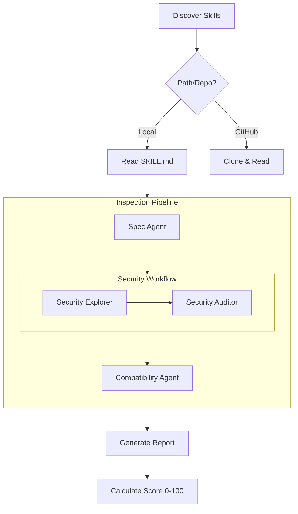

# Contributing to skill-inspector

Thank you for your interest in contributing to `skill-inspector`! This document provides technical details about the project's architecture and development workflows.

## Architecture

The inspector follows a sequential multi-agent workflow orchestrated by [Mastra](https://mastra.ai/):



### 1. Discovery Mechanism

The tool searches for `SKILL.md` files in standard locations across local directories and remote repositories:

- `SKILL.md` (Root)
- `skills/SKILL.md`, `skills/.curated/SKILL.md`, `skills/.experimental/SKILL.md`, `skills/.system/SKILL.md`
- `.agents/skills/SKILL.md`, `.agent/skills/SKILL.md`
- `.claude/skills/SKILL.md`, `.cursor/skills/SKILL.md`, `.cline/skills/SKILL.md`
- `.codex/skills/SKILL.md`, `.gemini/skills/SKILL.md`, `.goose/skills/SKILL.md`
- `.github/skills/SKILL.md`

If no skill is found in standard paths, it performs a recursive search for any `SKILL.md` file (excluding `node_modules` and dot-directories).

### 2. Security Workflow

- **Phase 1: Security Explorer**: Maps the environment, identifying scripts, dependencies, and potential attack vectors. It is designed to be "silent by default," only reporting genuine anomalies.
- **Phase 2: Security Auditor**: Performs a deep dive into the content and explorer findings to identify vulnerabilities like RCE, data exfiltration, and secret theft.

## Development

### Prerequisites

- [pnpm](https://pnpm.io/) (v10.x)
- Node.js (v20+)

### Setup

```bash
pnpm install
```

### Commands

- `pnpm dev`: Run the CLI in development mode using `tsx`.
- `pnpm test`: Run unit tests with Vitest.
- `pnpm lint`: Run linting checks with Trunk.
- `pnpm format`: Format code with Trunk.
- `pnpm build`: Compile TypeScript to JavaScript.

### Project Structure

- `src/agents/`: Definitions of specialized agents (Spec, Security, Compatibility).
- `src/workflows/`: Mastra workflow definitions for orchestration.
- `src/core/`: Core logic for LLM configuration, discovery, and types.
- `src/cli/`: CLI entry point and command handling.
