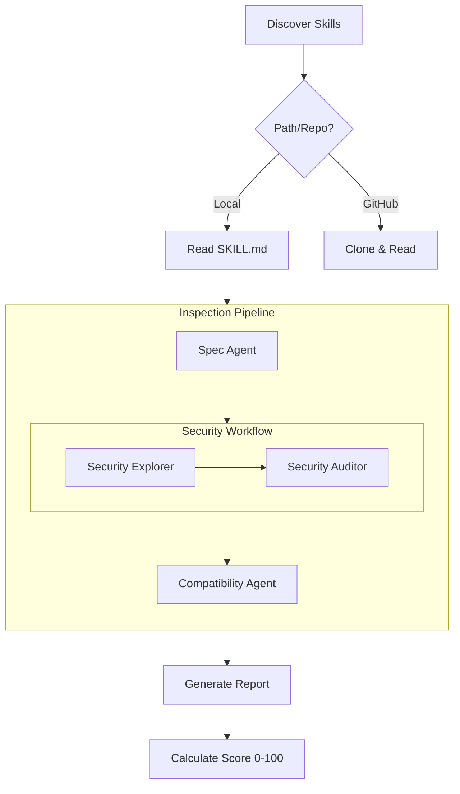

# skill-inspector

A sophisticated agentic tool built with [Mastra](https://mastra.ai/) to inspect AI Agent Skills for quality, security, and compatibility.

## Features

- **Multi-Agent Orchestration**: Leverages [Mastra](https://mastra.ai/) workflows to coordinate specialized agents (Spec, Security, Compatibility) in a robust, sequential pipeline.
- **Two-Phase Security Audit**: Implements a dedicated security workflow consisting of an **Explorer** agent for environment mapping and an **Auditor** agent for deep vulnerability analysis.
- **Spec Validation**: Validates skills against the [agentskills.io](https://agentskills.io) specification, checking frontmatter, naming, and descriptions.
- **Cross-Provider Compatibility**: Analyzes skills for provider-specific extensions (e.g., Claude-only XML tags) to ensure broad portability.
- **Robust Skill Discovery**: Supports 14+ standard skill locations (e.g., `.claude/skills/`, `.cursor/skills/`, `.gemini/skills/`) and remote GitHub repositories with recursive fallback.
- **Tool-Augmented Analysis**: Agents use filesystem explorers and spec lookups to provide grounded findings.

## Architecture

The inspector follows a sequential multi-agent workflow orchestrated by Mastra:



### 1. Discovery

The tool searches for `SKILL.md` files in standard locations across local directories and remote repositories:

- `SKILL.md` (Root)
- `skills/SKILL.md`, `skills/.curated/SKILL.md`, `skills/.experimental/SKILL.md`, `skills/.system/SKILL.md`
- `.agents/skills/SKILL.md`, `.agent/skills/SKILL.md`
- `.claude/skills/SKILL.md`, `.cursor/skills/SKILL.md`, `.cline/skills/SKILL.md`
- `.codex/skills/SKILL.md`, `.gemini/skills/SKILL.md`, `.goose/skills/SKILL.md`
- `.github/skills/SKILL.md`

If no skill is found in standard paths, it performs a recursive search for any `SKILL.md` file (excluding `node_modules` and dot-directories).

### 2. Security Workflow

- **Phase 1: Explorer**: Maps the environment, identifying scripts, dependencies, and potential attack vectors.
- **Phase 2: Auditor**: Performs a deep dive into the content and explorer findings to identify vulnerabilities like RCE, data exfiltration, and secret theft.

### 3. Scoring System

Starts at 100 points and applies severity-based deductions:

- **Critical**: -50 points
- **High**: -25 points
- **Medium**: -10 points
- **Low**: -2 points

## Installation

```bash
pnpm install
pnpm build
```

## Usage

```bash
# Inspect local directory
pnpm dev inspect ./my-skill

# Inspect a GitHub repository
pnpm dev inspect vercel-labs/agent-skills

# List available skills without inspecting
pnpm dev inspect ./my-skill --list

# Inspect specific skills by name
pnpm dev inspect ./my-skill --skill "git-commit" "test-and-fix"

# Specify LLM provider and model
pnpm dev inspect ./my-skill --provider anthropic --model claude-3-5-sonnet-20240620

# Output as JSON
pnpm dev inspect ./my-skill --json

# Debug mode (see agent logs and thoughts)
pnpm dev inspect ./my-skill --debug
```

## LLM Configuration

The inspector supports multiple providers and uses environment variables for configuration.

| Provider             | Default Model               | API Key Env Var                                   |
| :------------------- | :-------------------------- | :------------------------------------------------ |
| **OpenAI**           | `gpt-5.2`                   | `OPENAI_API_KEY`                                  |
| **Anthropic**        | `claude-4.5-haiku@20260315` | `ANTHROPIC_API_KEY`                               |
| **Google AI**        | `gemini-2.5-flash`          | `GOOGLE_API_KEY`                                  |
| **Mistral**          | `mistral-large-latest`      | `MISTRAL_API_KEY`                                 |
| **Groq**             | `llama-4-70b`               | `GROQ_API_KEY`                                    |
| **Vertex AI**        | `gemini-2.5-flash`          | `GOOGLE_VERTEX_PROJECT`, `GOOGLE_VERTEX_LOCATION` |
| **Anthropic Vertex** | `claude-4.5-haiku@20260315` | `GOOGLE_VERTEX_PROJECT`, `GOOGLE_VERTEX_LOCATION` |

### Example Setup

```bash
export LLM_PROVIDER=anthropic
export ANTHROPIC_API_KEY=your_key
pnpm dev inspect ./my-skill
```

## Development

- `pnpm test`: Run unit tests with Vitest.
- `pnpm lint`: Run linting checks with Trunk.
- `pnpm format`: Format code with Trunk.
- `pnpm build`: Compile TypeScript to JavaScript.

## License

Apache-2.0
